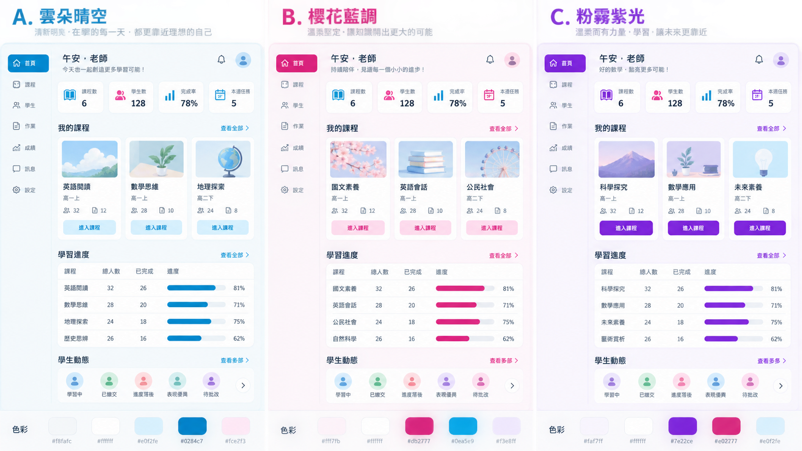

# 晴空粉（blossom）配色修正規格（2026-09-19，教師發包給 Codex，Claude 驗收）

## 目標
「晴空粉」是預設色系，要比照教師提供的舊版 v1.9 題庫系統截圖（Tailwind 色票）：
淺灰底 `#f8fafc`、白卡＋淡粉框 `#fce7f3`、大圓角（卡片 22px、按鈕 16px）、
天藍主色 `#0ea5e9`／標題 `#0284c7`、桃紅小標與進度膠囊 `#db2777`（膠囊底 `#fce7f3`、字 `#9d174d`）、
紫色標籤／閃卡 `#a855f7`（底 `#f3e8ff`、字 `#7e22ce`）、答錯紅 `#dc2626`／`#fef2f2`、答對綠 `#16a34a`／`#f0fdf4`、內文 `#1e293b`、次要字 `#64748b`。
整體感覺：明亮、留白、粗體字、少深色大色塊。

## 目前已知問題（教師 2026-09-19 截圖）
1. **教師側欄**：`--nav` 為亮藍 `#0369a1`，但「目前頁面」與「平台設定」按鈕仍是寫死的深海軍藍，兩者撞色。改為：側欄白色（或 `#f8fafc`）＋右側淡粉分隔線、深色文字；目前頁面用淡粉底 `#fdf2f8`＋桃紅字 `#db2777`；平台設定按鈕同一套樣式，不要深色方塊；帳號區、版本字也要可讀。
2. **學生頂部列**（`.student-nav`，寫死 `#17394d`）：改白底＋淡粉下框、課程選單與「切換帳號／登出」為白底淺框按鈕、版本字 `#64748b`。
3. **所有寫死的深色與舊藍色**：`src/style.css` 內約 186 處十六進位色碼，逐一檢查在 blossom 下是否突兀（深色背景、`#17394d`、`#226ea3`、`#edf5fa` 淺藍底、`#e6edf1` 等）。只針對 `:root[data-theme='blossom']` 覆寫，不改其他色系的外觀。
4. **表單控制項**：checkbox／radio 使用 `accent-color: #0ea5e9`；select、input 聚焦時框線用天藍。
5. **提示框**：`.notice` 淡藍底改為白底＋淡粉框或淡天藍 `#f0f9ff`；`.notice.warning`（待同步）用 `#fffbeb` 底＋`#fde68a` 框。
6. **班級對照表**：列標題文字改內文色並加粗，「全部」列保留淡粉底；表頭改白底。
7. **完成度看板、題目分析、報表、教材診斷、學習進度、題庫管理、班級名冊** 等教師頁：表格表頭、長條、徽章都改用上述色票，確認沒有殘留深藍色塊。

## 限制
- 原始任務只改 CSS（必要時加 className，不改行為與資料）；教師後續明確授權新增色系選單與班級覆寫的 `All` 選項，不動 Functions、不動 Firestore、不改 Google Sheet。
- 其他色系（海洋藍、森林綠、紫羅蘭、夜間）外觀不可改變。
- 字級「大／特大」下不可重疊或溢出；手機 390px 寬度要正常。
- 對比：一般文字與背景對比至少 4.5:1。

## 交付與驗收
- 補靜態測試：blossom 下 `.sidebar`、`.student-nav` 不再使用深色背景；checkbox 有 accent-color。
- `npm run check` 全部通過。
- 在 `docs/` 附上桌機 1300px 與手機 390px 的截圖（教師：課程與教材、完成度看板、學習進度；學生：首頁、單元練習、作答、測驗結果），可用 Playwright + memoryApi 產生。
- 更新 `DEVELOPMENT_LOG.md`、`handoff.md`，標示「晴空粉修正待 Claude 驗收」附 commit hash。**不部署、不合併或推送 main。**

## 教師核定的三方案（2026-09-19）

原本的單一「晴空粉」改為可切換的三套色系，A 為預設；既有使用者的
`blossom` 偏好沿用 A，其他既有色系不變。

| 選項 | 名稱 | 主色 | 強調色 |
| --- | --- | --- | --- |
| A | 雲朵晴空 | 天藍 `#0ea5e9` | 桃紅 `#db2777` |
| B | 櫻花藍調 | 桃紅 `#db2777` | 天藍 `#0ea5e9` |
| C | 粉霧紫光 | 紫色 `#7e22ce` | 桃紅 `#db2777` |

本機操作示例已驗證三個選項均能切換；教師端「課程與教材」的班級覆寫下拉
預設為 `All`，在此選項下變更或恢復設定會批次套用到全部班級。
